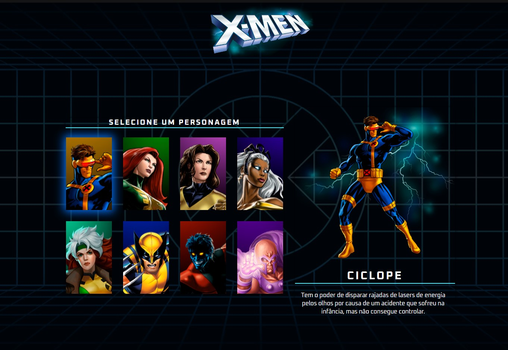

# Site X-Men

O Site X-Men é uma simulação de tela de escolha de personagem dos X-Men, com descrições detalhadas sobre cada um deles.

## Acesso ao Site

Acesse o site do X-Men pelo link: [Site X-Men](https://exemplo.com)

## Descrição do Projeto

O Site X-Men é um projeto desenvolvido com o objetivo de criar uma experiência interativa e imersiva para os fãs dos X-Men. Nesse site, os usuários poderão explorar informações sobre os personagens e escolher qual deles desejam conhecer mais a fundo.

## Funcionalidades

- Escolha de Personagem: Os usuários poderão selecionar um personagem dos X-Men para visualizar informações detalhadas sobre ele.
- Descrição Detalhada: Cada personagem terá uma descrição completa, incluindo história de origem, poderes e habilidades.
- Imagens e Ilustrações: O site contará com imagens e ilustrações dos personagens para tornar a experiência mais visualmente atrativa. Tanto ícone e imagem grande.

## Tecnologias Utilizadas

O projeto do Site X-Men foi desenvolvido utilizando as seguintes tecnologias:

- HTML5
- CSS3
- JavaScript

## Contribuições

Contribuições são bem-vindas para melhorias e expansão do Site X-Men.

 Se você tiver sugestões ou desejar contribuir para o projeto, sinta-se à vontade para abrir uma issue ou enviar um pull request.

## Autor

Canal Dev em dobro
link do canal: https://www.youtube.com/c/devemdobro
